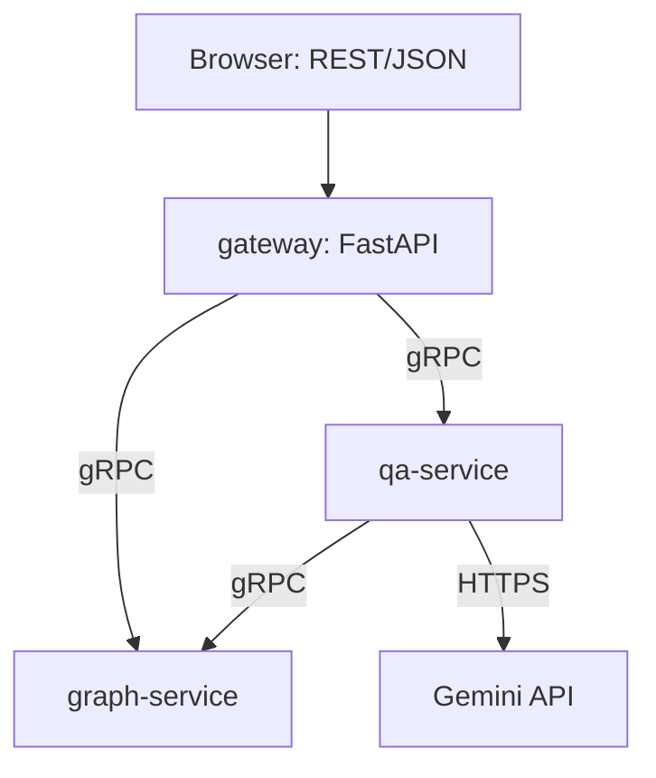

# Code-Mapper

A static call-graph tool for Python repositories, split into three microservices (gRPC internally, REST at the edge), containerized with Docker, and deployable to Kubernetes.

Every edge in the call graph carries an honest confidence label instead of a guess. This repo also contains the evaluation harness used to measure that honesty against hand-labelled ground truth.

## Results

Measured at tag `v1-scored` (https://github.com/5ahar-K/CodeMapper_advanced_version/releases/tag/v1-scored), on 100 randomly sampled, manually verified call sites in [pallets/click](https://github.com/pallets/click).

| method | precision | recall | abstains |
|---|---|---|---|
| baseline (original name-matching heuristic) | 0.43 (0.30-0.60) | 0.76 (0.61-0.90) | 16% |
| new resolver: high confidence only | 1.00 | 0.66 (0.53-0.80) | 39% |
| new resolver: high + medium | 1.00 | 0.67 (0.54-0.81) | 38% |
| **new resolver: high + medium + low (default)** | **1.00** | **0.77 (0.63-0.91)** | 29% |
| new resolver: everything incl. ambiguous | 0.72 (0.59-0.87) | 0.95 (0.89-0.99) | 16% |

Ranges are 95% bootstrap intervals over the 100 sampled call sites.

The "baseline" heuristic above is the original name-matching approach from an earlier version of this tool: https://github.com/5ahar-K/CodeGraph-agent. `baseline.py` in this repo is a frozen, faithful copy of that logic, kept only so the two can be compared fairly on the same ground truth.

**Reading it:** the original heuristic was wrong more often than right (0.43 precision) because it linked calls by name alone, regardless of the object making the call. The new resolver produced zero incorrect links on this sample at a comparable recall to the baseline (0.76 vs 0.77), by using scope, imports and class hierarchy before falling back to a name-only guess.

**Labelling method:** rows 1-35 labelled by hand, reading the source at each call site. Rows 36-100 labelled with AI assistance and spot-checked by hand. Ground-truth rules used:
- `self.method()` resolved through the enclosing class's hierarchy; overrides in subclasses are not counted as separate true targets.
- `super().method()` the first parent (left to right, for multiple inheritance) that defines the method.
- Calls on built-in types (`list`, `dict`, `str`, file objects) are labelled as external, even if a same-named method exists elsewhere in the repo.
- Where the receiver's exact type is only known at runtime (e.g. a class chosen from user input), all statically possible targets are labelled as true.

A bug in the scoring script itself (chained calls like `a.b().c()` were occasionally scored against the wrong sub-call) was found and fixed during this process; the table above reflects the corrected scorer.

**Two small resolver fixes** (generic base classes written as `class X(Base[int])`, and nested functions defined once per branch of an `if`/`elif`/`else`) were made *after* the commit above was scored. They are correct, see `apply_fix.py` and their accompanying tests in `tests/test_codemapper.py`, but have not yet been re-measured on a fresh sample, so no new numbers are claimed for them.

## Known limits

- Type hints and `typing.cast(...)` are not used to infer a receiver's type.
- An attribute's type (e.g. `self.type` set to different classes depending on configuration) is not tracked; such calls resolve as ambiguous.
- Where a class is chosen entirely at runtime (e.g. from a command-line argument), the resolver lists every statically possible target rather than picking one.
- Class hierarchy uses breadth-first traversal, not exact Python C3 MRO.
- Dynamic dispatch (plugin registries, `getattr`) is invisible to static analysis by construction.

## Architecture



- **graph-service** wraps `codemapper`'s `Index`/`Resolver`/graph code behind a gRPC interface (`BuildGraph`, `GetCallers`, `GetBlastRadius`).
- **qa-service** is both a gRPC server (answers `Ask` requests) and a gRPC client (calls graph-service for context before asking the LLM). Demonstrates service-to-service communication, not just client-to-service.
- **gateway** is the only service exposed outside the cluster. Translates REST/JSON requests into gRPC calls to the other two. Everything else is only reachable from inside the network.

Each service is defined by a `.proto` contract (`services/*/proto/`), compiled to Python stubs, and packaged in its own Docker image.

## Running it

### Locally (no Docker)

```
pip install -r requirements.txt
python -m pytest
python -m codemapper stats path/to/repo
python -m codemapper top path/to/repo -n 10
```

### As three services (Docker Compose)

```
git clone --depth 1 https://github.com/pallets/click.git sample_repo
$env:REPO_PATH_ON_YOUR_COMPUTER = "$(pwd)\sample_repo"
$env:GEMINI_API_KEY = "your-key"
docker compose up --build
```

Then open http://localhost:8000/docs.

### On Kubernetes (minikube)

```
minikube start --driver=docker --container-runtime=docker
minikube docker-env | Invoke-Expression
git clone --depth 1 https://github.com/pallets/click.git sample_repo
docker compose build
kubectl create secret generic gemini-api-key --from-literal=api-key="your-key"
kubectl apply -f k8s/
kubectl get pods
minikube service gateway --url
```

Open the printed URL followed by `/docs`. Note: the Kubernetes images bake `sample_repo/` into the container at build time (`/app/sample_repo`) rather than mounting it live, to avoid the added complexity of sharing a host folder into minikube's own VM.

## Reproducing the evaluation

```
python -m evaluation.sample_calls path/to/repo --n 100 --seed 0 --out labels.csv
python -m evaluation.score path/to/repo labels.csv --show-errors "new: high + medium + low"
```

Label `true_labels` by hand between those two commands, reading the source at each call site.

## Project structure

```
codemapper/     the analysis engine: parsing, cross-file resolution, confidence-tiered
                call resolution, graph construction, LLM prompt building
evaluation/     the measurement harness: sampling, scoring, LLM-behaviour evaluation
services/       the three microservices (graph-service, qa-service, gateway) with
                their .proto contracts, generated gRPC code, and Dockerfiles
k8s/            Kubernetes manifests (Deployment + Service per microservice, Secret
                for the Gemini API key)
tests/          unit tests for the resolver, plus a hand-built "toy repo" fixture
                with known-by-hand correct answers for every resolution rule
apply_fix.py    a kept record of two post-evaluation bug fixes (see Results, above)
```
